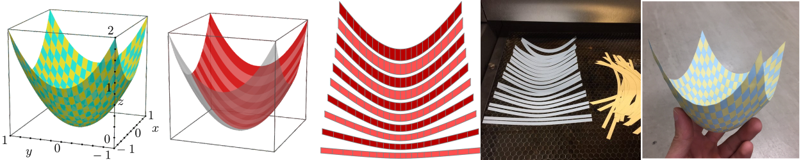
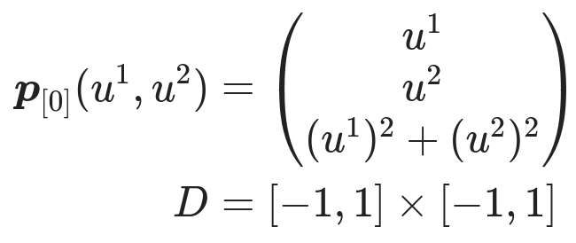
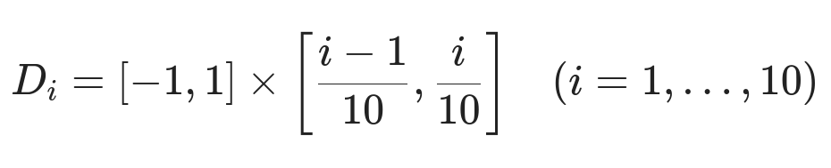
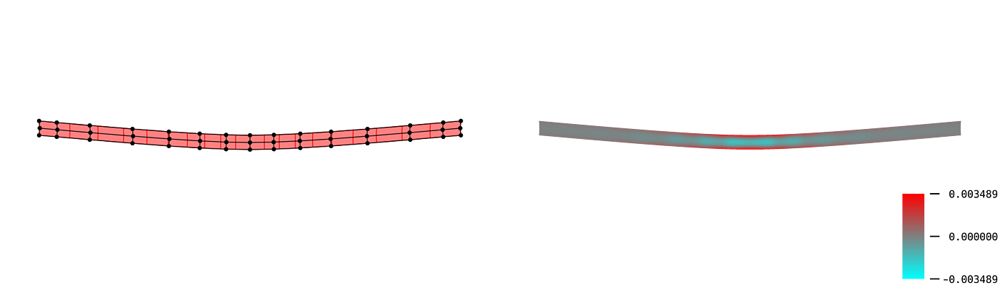
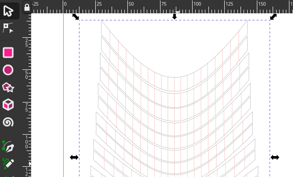
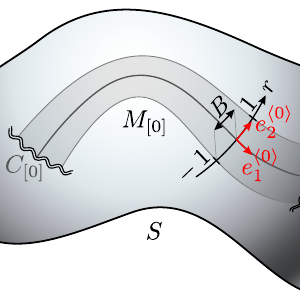
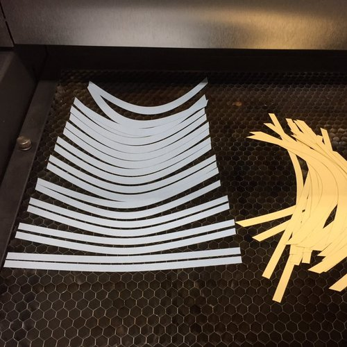
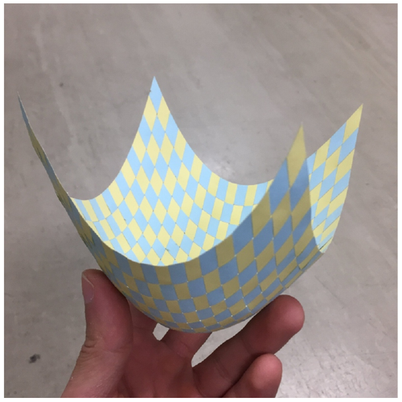

# Elastic Surface Embedding; Weaving Parer Strips

## TL;DR
You can make a *holdable* smooth surface model with this repository.

The main part of this project is how to determine a planer shape from a strip on curved surface.
In mathematics, this mapping is called "embedding".
We determined the embedding by minimizing its elastic strain energy.
This is the meaning of "Elastic Surface Embedding".

## Overview: How to make a surface model
### step 1 : Define a shape of surface (and split into strips)
The definition must consists of parametric mapping and its domain.
For example, a paraboloid can be parametrized as below.

The domain D will be split into D_i.

### step 2 : Numerical analysis
This is the main part.
Split the surface into pieces, and compute the Eucledian embedding.
For more information, read [this document](/Julia).
The image below is a result for the domain D_1.

### step 3 : Edit on vector graphics editor
The output files are SVG format.
After editing the svg files, you can print the graphics or cut papers by laser cutting machine.

### step 4 : Craft a paper model
This is the final step.
Cut papers into strips, and weave them into surface.

## Directions: If you like..
### ..making crafts:scissors:
|  | Download the [Paraboloid example](/Example/Paraboloid.pdf) and [make your own surface model](Craft).   Laser cutting machine is useful, but it's not necessary. |
| --- | :-- |

### ..computing:octocat:
|  | Clone this repository, and run the [Julia code](/Julia) or [Wolfram code](/Wolfram)!   Any issues and pull requests are welcomed. |
| --- | :-- |

### ..mathematics or physics:globe_with_meridians:
|  | Read our upcoming paper. Here's our theoretical framework:   ・Mathematical model: [Nonlinear elasticity](https://www.sciencedirect.com/topics/engineering/geometric-nonlinearity) on [Riemannian manifold](https://en.m.wikipedia.org/wiki/Riemannian_manifold)   ・Geometric representation: [NURBS (esp. B-spline manifold)](https://en.wikipedia.org/wiki/Non-uniform_rational_B-spline)   ・Numerical analysis: [Galerkin method](https://en.wikipedia.org/wiki/Galerkin_method), [Newton-Raphson method](https://en.wikipedia.org/wiki/Newton%27s_method) |
| --- | :-- |

### ..me!:bowtie:
|  | Follow [my twitter account](https://twitter.com/Hyrodium).   Visit [my website](https://hyrodium.github.io/).   Read my upcoming paper. |
| --- | :-- |

## Gallery
    

