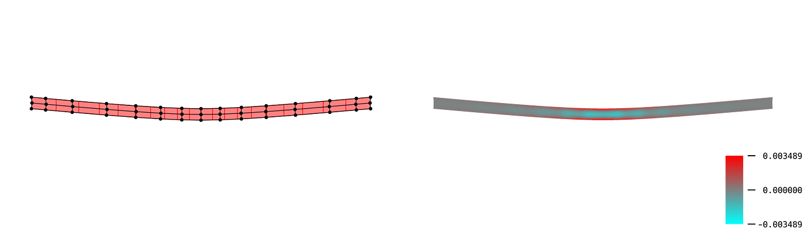

# Elastic Surface Embedding; Weaving Parer Strips

***👉👉[Read my paper on arXiv!!](https://arxiv.org/abs/2211.06372)👈👈***

## TL;DR
You can make a *holdable* smooth surface model with this repository.

The main part of this project is how to determine a planer shape from a strip on curved surface.
In mathematics, this mapping is called "embedding".
We determined the embedding by minimizing its elastic strain energy.
This is the meaning of "Elastic Surface Embedding".

## Overview: How to make a surface model
### step 1: Define a shape of a surface (and split it into strips)
The definition must consist of parametric mapping and its domain.
For example, a paraboloid can be parametrized as below.

$$
\begin{aligned}
\boldsymbol{p}_{[0]}(u^1,u^2)
&= \begin{pmatrix}
u^1 \\
u^2 \\
(u^1)^2+(u^2)^2
\end{pmatrix} \\
D
&= [-1,1] \times [-1,1]
\end{aligned}
$$

The domain $D$ will be split into $D^{(i)}$.

$$
\begin{aligned}
D^{(i)}
= [-1,1] \times \left[\frac{i-1}{10}, \frac{i}{10}\right] \qquad (i = 1,...,10)
\end{aligned}
$$

### step 2: Numerical analysis
This is the main part.
Split the surface into pieces, and compute the Eucledian embedding.
For more information, read [this document](/Julia).
The image below is a result for the domain $D_1$.

### step 3: Edit on your favorite vector graphics editor
The output files are SVG format.
After editing the svg files, you can print the graphics or cut papers by laser cutting machine.

### step 4: Craft a paper model
This is the final step.
Cut papers into strips, and weave them into the surface.

## Directions: If you like..
### ..making crafts:scissors:
|  | Download and print a paraboloid example or a hyperbolic paraboloid example from [my paper on arXiv](https://arxiv.org/abs/2211.06372), and <a href="https://hyrodium.github.io/ElasticSurfaceEmbedding.jl/dev/craft/">make your own surface model.   Laser cutting machine is useful, but it's not necessary. |
| --- | :-- |

### ..computing:octocat:
|  | Clone this repository, and run the [Julia code](/Julia) or [Wolfram code](/Wolfram)!   Any issues and pull requests are welcomed. |
| --- | :-- |

### ..mathematics or physics:globe_with_meridians:
|  | Read [our paper on arXiv](https://arxiv.org/abs/2211.06372). Here's our theoretical framework:   ・Mathematical model: [Nonlinear elasticity](https://www.sciencedirect.com/topics/engineering/geometric-nonlinearity) on [Riemannian manifold](https://en.m.wikipedia.org/wiki/Riemannian_manifold)   ・Geometric representation: [B-spline manifold](https://en.wikipedia.org/wiki/Non-uniform_rational_B-spline)   ・Numerical analysis: [Galerkin method](https://en.wikipedia.org/wiki/Galerkin_method), [Newton-Raphson method](https://en.wikipedia.org/wiki/Newton%27s_method) |
| --- | :-- |

### ..me!:bowtie:
|  | Follow [my twitter account](https://twitter.com/Hyrodium).   Visit [my website](https://hyrodium.github.io/).   Read [my paper on arXiv](https://arxiv.org/abs/2211.06372). |
| --- | :-- |

## Gallery
    

