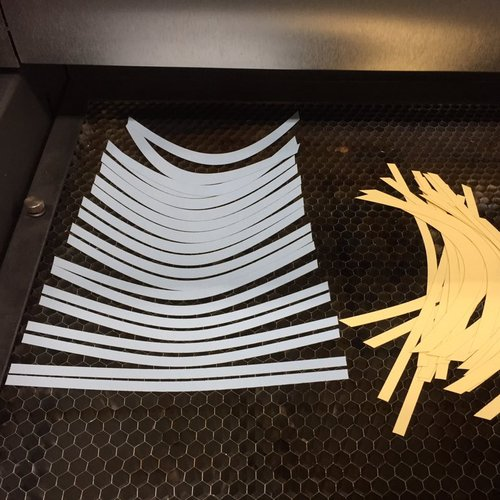
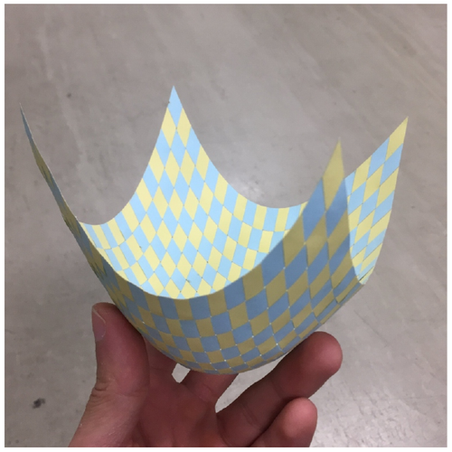
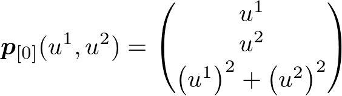

# Elastic Surface Embedding

## TL;DR
You can make a *holdable* smooth surface model with this repository.

    

The main part of this project is how to determine a planer shape from a strip on curved surface.
In mathematics, this mapping is called "embedding".
We determined the embedding by minimizing its elastic strain energy.
This is the meaning of "Elastic Surface Embedding".

## How to make a surface model (overview)
### step 1 : Define a shape of piece of surface (and split into strips)
The definition must consists of parametric mapping and its domain.

### step 2 : Numerical analysis
This is the main part.
Split the surface into pieces, and compute the Eucledian embedding.
For more information, read [this document](/Julia/HowToRunJuliaCode.md).

### step 3 : Edit on vector graphics editor
The output files are svg format.
You can print the graphics or cut papers by laser cutting machine, so this step is for preparation.

[Graphics here]

### step 4 : Craft a paper model
This is the final step.
Cut papers into strips, and weave and glue the paper strips.

[Graphics here]

## If you like..
### ..making crafts
Download the [Paraboloid example](/Example/Paraboloid.pdf), print it, cut it, glue them, and make your own surface model!

Document: [How to Make your own surface model:scissors:](Example/HowToMakePaperModel.md)

### ..computing
Clone this repository, and run the [Julia code](/Julia/HowToRunJuliaCode.md) or [Wolfram code](/Wolfram/HowToRunWolframCode.md)

Any issues and pull requests are welcomed. :octocat:

### ..mathematics or physics
Read my upcoming paper.

### ..me!
Follow [my twitter account](https://twitter.com/Hyrodium), visit [my website](https://hyrodium.github.io/Profile) and read my upcoming paper. :bowtie:

## Theoretical framework

* [Elasticity](https://en.m.wikipedia.org/wiki/Elasticity_(physics))
    * [Nonlinear elasticity (geometric non-linearity)](https://www.sciencedirect.com/topics/engineering/geometric-nonlinearity) on [Riemannian manifold](https://en.m.wikipedia.org/wiki/Riemannian_manifold)
* Numerical analysis
    * [NURBS](https://en.wikipedia.org/wiki/Non-uniform_rational_B-spline)
    * [Galerkin method](https://en.wikipedia.org/wiki/Galerkin_method)
    * [Newton-Raphson method](https://en.wikipedia.org/wiki/Newton%27s_method)

For more information, my upcoming paper.

## Gallery
    

