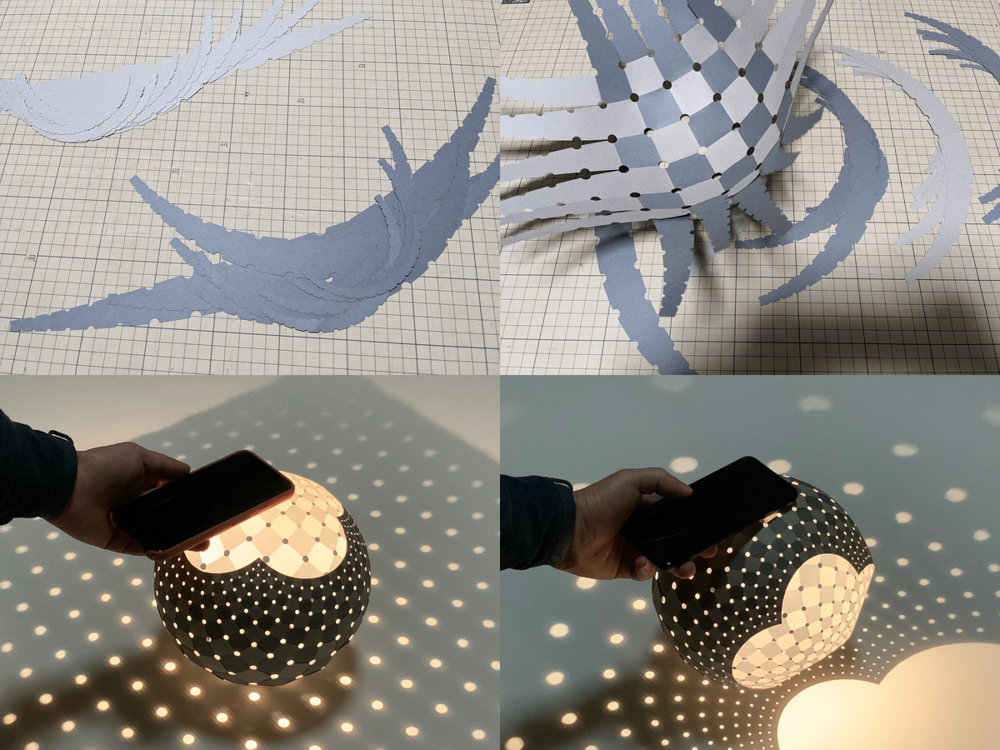

# Elastic Surface Embedding; Weaving Parer Strips

[](https://hyrodium.github.io/ElasticSurfaceEmbedding.jl/stable)
[](https://hyrodium.github.io/ElasticSurfaceEmbedding.jl/dev)
[](https://github.com/hyrodium/ElasticSurfaceEmbedding.jl/actions)
[](https://codecov.io/gh/hyrodium/ElasticSurfaceEmbedding.jl)
[](https://github.com/JuliaTesting/Aqua.jl)
[](https://arxiv.org/abs/2211.06372)

## JuliaCon2023 Talk! 📣🕙
I gave a lightning talk about this repository at JuliaCon2023!

[](https://www.youtube.com/watch?v=0gRVPLfZl7w)

* [Pretalx page](https://pretalx.com/juliacon2023/talk/RBHAER/)
* [Slides](https://www.docswell.com/s/hyrodium/5JL8EQ-JuliaCon2023)

## TL;DR
You can make a *holdable* smooth surface model with this repository.


The main part of this project is how to determine a planer shape from a strip on the target curved surface.
In mathematics, this mapping is called "embedding".
We determined the embedding by minimizing its elastic strain energy.
This is the meaning of "Elastic Surface Embedding".

## Overview: How to make a surface model
### step 1: Define a shape of a surface (and split it into strips)
The definition must consist of parametric mapping and its domain.
For example, a paraboloid can be parametrized as below.

$$
\begin{aligned}
\boldsymbol{p}_{[0]}(u^1,u^2)
&= \begin{pmatrix}
u^1 \\
u^2 \\
(u^1)^2+(u^2)^2
\end{pmatrix} &
(u^1, u^2)
\in [-1,1] \times [-1,1]
\end{aligned}
$$

The domain will be split into $D^{(i)}$.

$$
\begin{aligned}
D^{(i)}
= [-1,1] \times \left[\frac{i-1}{10}, \frac{i}{10}\right] \qquad (i = 1,...,10)
\end{aligned}
$$

### step 2: Numerical analysis
This is the main part.
Split the surface into strips, and compute the embeddings.

```julia
using ElasticSurfaceEmbedding
using IntervalSets
using StaticArrays
# Overload the shape definition
ElasticSurfaceEmbedding.surface(x,y) = SVector(x, y, x^2+y^2)
# (1) split the surface into strips
dom = [(-1..1, (i-1)/10..i/10) for i in 1:10]
# (2) Embed the strips onto a plane
res = auto_allsteps(dom)
export_pinned_steps("paraboloid", res)
```

For more information, read [this document](https://hyrodium.github.io/ElasticSurfaceEmbedding.jl/dev/run-julia/).
The image below is a result for the domain $D^{(1)}$.


### step 3: Edit on your favorite vector graphics editor
The output files are in SVG format.
After editing the SVG files, you can print the graphics or cut papers with a laser cutting machine.


### step 4: Craft a paper model
This is the final step.
Cut papers into strips, and weave them into the surface.


## Directions: If you like..
### ..making crafts :scissors:
|  | Print Appendix B from [my paper on arXiv](https://arxiv.org/abs/2211.06372), and <a href="https://hyrodium.github.io/ElasticSurfaceEmbedding.jl/dev/craft/">make your own surface model. <br> Laser cutting machine is useful, but it's not necessary. |
| --- | :-- |

### ..computing :octocat:
|  | Clone this repository, and run the [Julia code](https://hyrodium.github.io/ElasticSurfaceEmbedding.jl/dev/run-julia/) or [Wolfram code](https://github.com/hyrodium/ElasticSurfaceEmbedding-wolfram)! <br> Any issues and pull requests are welcomed. |
| --- | :-- |

### ..mathematics or physics :globe_with_meridians:
|  | Read [our paper on arXiv](https://arxiv.org/abs/2211.06372). Here's our theoretical framework: <br> ・Mathematical model: [Nonlinear elasticity](https://www.sciencedirect.com/topics/engineering/geometric-nonlinearity) on [Riemannian manifold](https://en.m.wikipedia.org/wiki/Riemannian_manifold) <br> ・Geometric representation: [B-spline manifold](https://en.wikipedia.org/wiki/Non-uniform_rational_B-spline) <br> ・Numerical analysis: [Galerkin method](https://en.wikipedia.org/wiki/Galerkin_method), [Newton-Raphson method](https://en.wikipedia.org/wiki/Newton%27s_method) |
| --- | :-- |

### ..me! :bowtie:
|  | Follow [my twitter account](https://twitter.com/Hyrodium). <br> Visit [my website](https://hyrodium.github.io/). <br> Read [my paper on arXiv](https://arxiv.org/abs/2211.06372). |
| --- | :-- |

## Gallery
    



