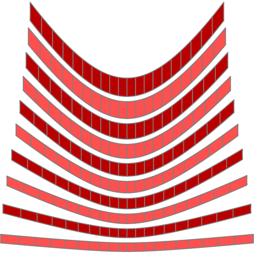

# Elastic Surface Embedding

## Overview
You can make a smooth surface model by this code.

   

## Prerequisite
### Julia
In this repository, Julia is for numerical analysis of surface embedding.

* Julia(≥v1.3)
* Packages
    * IntervalSets
    * Luxor
    * Colors
    * JLD
    * ForwardDiff
    * DifferentialEquations
    * FastGaussQuadrature
* Slack (optional)
    * Incoming webhook URL
    * OAuth access token
    * Channel ID

### Mathematica
Mathematica is for proof of the main theorem of my theory.
So, you don't need Mathematica if you just want to make a surface model.

* Mathematica(≥v12.0)

## How to make a surface model
### Step 1 : Define shape

### Step 2 : Numerical analysis

### Step 3 : Edit on vector graphics editor

### Step 4 : Craft a paper model

## Theoretical framework

* Elasticity
    * Nonlinear elasticity (geometric non-linearity) on Riemannian manifold
* Numerical analysis
    * [NURBS](https://en.wikipedia.org/wiki/Non-uniform_rational_B-spline)
    * [Galerkin method](https://en.wikipedia.org/wiki/Galerkin_method)
    * [Newton-Raphson method](https://en.wikipedia.org/wiki/Newton%27s_method)

## More information
Visit [my website](https://hyrodium.github.io/Profile/) or read my coming paper.
