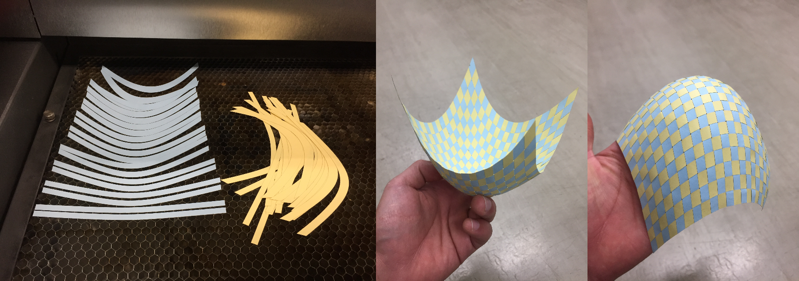
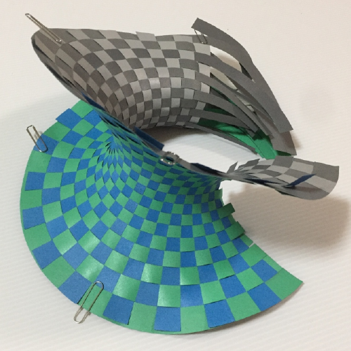

# Craft

## Question: How can I make the model?
You can:
* download [the paraboloid paper strip data](https://github.com/hyrodium/ElasticSurfaceEmbedding.jl/tree/develop/craft), and cut by scissors.
    * It would be hard, but not impossible.
* download [the paraboloid paper strip data](https://github.com/hyrodium/ElasticSurfaceEmbedding.jl/tree/develop/craft), and cut by laser cutting machine.
    * I use [Beambox by FLUX.inc](https://flux3dp.com/beambox/), btw.
* compute the shape of paper strip, instead of downloading the paraboloid.
    * This needs setup for Julia environment.
* buy already cut pieces of paper at Booth.
    * Ships from Japan.

## Steps

