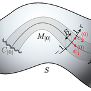

# Elastic Surface Embedding

## TL;DR
You can make a *holdable* smooth surface model with this repository.


The main part of this project is how to determine a planer shape from a strip on curved surface.
In mathematics, this mapping is called "embedding".
We determined the embedding by minimizing its elastic strain energy.
This is the meaning of "Elastic Surface Embedding".

## Overview: How to make a surface model
### step 1 : Define a shape of surface (and split into strips)
The definition must consists of parametric mapping and its domain.
For example, a paraboloid can be parametrized as below.

```math
\begin{aligned}
\bm{p}_{[0]}(u^1, u^2)
&= \begin{pmatrix}
u^1 \\
u^2 \\
(u^1)^2 + (u^2)^2
\end{pmatrix} \\
D
&= [-1,1]\times[-1,1]
\end{aligned}
```

The domain ``D`` will be split into ``D_i``.

```math
\begin{aligned}
D_i
&= [-1,1]\times\left[\frac{i-1}{10},\frac{i}{10}\right] & (i=1,\dots,10)
\end{aligned}
```

### step 2 : Numerical analysis
This is the main part.
Split the surface into pieces, and compute the Eucledian embedding.
For more information, read [this document](/Julia).
The image below is a result for the domain ``D_1``.


### step 3 : Edit on vector graphics editor
The output files are SVG format.
After editing the svg files, you can print the graphics or cut papers by laser cutting machine.


### step 4 : Craft a paper model
This is the final step.
Cut papers into strips, and weave them.


## Directions: If you like..
### ..making crafts ✂️
```@raw html
<div style="display:table;  width:100%;">
    <div style="display:table-cell; width:160px;">
        
    </div>
    <div style="display:table-cell; vertical-align:middle;">
        Download the [Paraboloid example](/Example/Paraboloid.pdf) and [make your own surface model](Craft).
        Laser cutting machine is useful, but it's not necessary.
    </div>
</div>
```

### ..computing 💻
```@raw html
<div style="display:table;  width:100%;">
    <div style="display:table-cell; width:160px;">
        
    </div>
    <div style="display:table-cell; vertical-align:middle;">
        Clone this repository, and run the Julia script or Wolfram script!
        Any issues and pull requests are welcomed.
    </div>
</div>
```

### ..mathematics or physics 🌐

```@raw html
<div style="display:table;  width:100%;">
    <div style="display:table-cell; width:160px;">
        
    </div>
    <div style="display:table-cell; vertical-align:middle;">
        Read my upcoming paper. Here's our theoretical framework:
        <ul>
            <li>Mathematical model: <a href="https://www.sciencedirect.com/topics/engineering/geometric-nonlinearity">Nonlinear elasticity</a> on <a href="https://en.m.wikipedia.org/wiki/Riemannian_manifold">Riemannian manifold</a></li>
            <li>Geometric representation: <a href="https://en.wikipedia.org/wiki/Non-uniform_rational_B-spline">NURBS</a></li>
            <li>Numerical analysis: <a href="https://en.wikipedia.org/wiki/Galerkin_method">Galerkin method</a>, <a href="https://en.wikipedia.org/wiki/Newton%27s_method">Newton-Raphson method</a></li>
        </ul>
    </div>
</div>
```

### ..me! 🐢
```@raw html
<div style="display:table;  width:100%;">
    <div style="display:table-cell; width:160px;">
        
    </div>
    <div style="display:table-cell; vertical-align:middle;">
        Follow <a href="https://twitter.com/Hyrodium">my twitter account</a>.
        Visit <a href="https://hyrodium.github.io/">my website</a>.
        Read my upcoming paper.
    </div>
</div>
```
