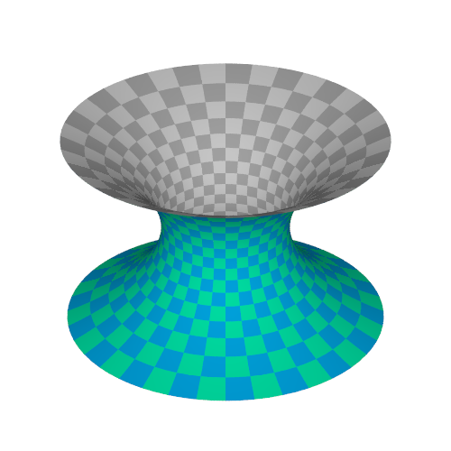

# [Numerical computation](@id numerical_computation)

## Installation
On Julia's package mode, run the following commands.
```julia-repl
pkg> add IntervalSets
pkg> add StaticArrays
pkg> add BasicBSpline
pkg> add https://github.com/hyrodium/BasicBSplineExporter.jl
pkg> add https://github.com/hyrodium/ElasticSurfaceEmbedding.jl
```

## Overview of our method
The computation process proceeds as shown in the following flowchart (from our paper):


## Example: Paraboloid
Through this section, we treat a paraboloid ``z=x^2+y^2`` as an example.


### Load packages, and optional configuration
Load packages with the following script.
```@example paraboloid
using IntervalSets
using BasicBSpline
using StaticArrays
using ElasticSurfaceEmbedding
```

### Define the shape of surface
```@example paraboloid
ElasticSurfaceEmbedding.𝒑₍₀₎(u¹,u²) = SVector(u¹, u², u¹^2+u²^2)
```

```math
\begin{aligned}
\bm{p}_{[0]}(u^1, u^2)
&= \begin{pmatrix}
u^1 \\
u^2 \\
(u^1)^2 + (u^2)^2
\end{pmatrix} \\
D
&= [-1,1]\times[-1,1]
\end{aligned}
```

!!! info "Direction of the surface"
    In the next step, we will split the surface into elongated strips.
    The domain of each strip should be rectangular, and the longer direction is `u¹`, and the shorter direction is `u²`.
    The paraboloid has four‐fold symmetry, so we don't have to take care of it.

### Split the surface into strips
The domain ``D`` will be split into ``D_i``.

```math
\begin{aligned}
D_i
&= [-1,1]\times\left[\frac{i-1}{10},\frac{i}{10}\right] & (i=1,\dots,10)
\end{aligned}
```


In julia script, just define a domain of the strip with function `D(i,n)`.

```@example paraboloid
n = 10
D(i,n) = (-1.0..1.0, (i-1)/n..i/n)
```

### Check the strain prediction
Before computing the embedding numerically, we can predict the strain with *Strain Approximation Formula*:

```math
\begin{aligned}
E_{11}^{\langle 0\rangle}&\approx\frac{1}{2}K_{[0]}B^2\left(r^2-\frac{1}{3}\right)
\end{aligned}
```

```@docs
show_strain
```

```@example paraboloid
for i in 1:n
    show_strain(D(i,n))
end
```

!!! tip "Allowable strain"
    Positive number means tension, and negative number means compression.
    Empirically, it is better if the absolute value of strain is smaller than ``0.01 (=1\%)``.

### Initial state
If you finished checking the strain prediction, the next step is determination of the initial state.

```@docs
initial_state
initial_state!
```

From this section, the computing is done for each piece of the surface.
First, let's calculate for ``i=1``.
```@example paraboloid
i = 1
```

As a first step, let's compute the initial state.

```@example paraboloid
allsteps = initial_state(D(i,n), n₁=19)
```

### Newton-Raphson method iteration

```@example paraboloid
newton_onestep!(allsteps, fixingmethod=:fix3points)
newton_onestep!(allsteps)
```

You can choose the fixing method from below:
* `:default` (default)
* `:fix3points`

```@docs
newton_onestep!
```

### Refinement of B-spline manifold

```@docs
refinement!
```

```@example paraboloid
refinement!(allsteps, p₊=(0,1),k₊=(EmptyKnotVector(),KnotVector([(i-1/2)/10])))
```

The knotvector to be inserted in `refinement!` can be suggested by `show_knotvector` function.

```@docs
show_knotvector
```

### Pin the state
If you finished computing for the strip, it's time to *pin* the state.
This pin📌 will be used for the next final step.

```@docs
pin
```

```@example paraboloid
pin(allsteps, result)
```

If you add a pin mistakenly, you can remove the pin with `remove_pin` function.

```@example paraboloid
unpin(result, 10)
```

```@docs
unpin
```

### Export all pinned shapes
This is the final step of the computational process.

```@docs
export_pinned_steps
```

This will create SVG files in `~/ElasticSurfaceEmbedding-Result/Paraboloid/pinned/`.

You can edit these files, and craft them into curved surface shape.


### Utilities
If you want to resume the computation, you can just call `settings` like this:

```julia
settings("Paraboloid")
```

## Other examples
### Catenoid


```julia
## Load packages
using IntervalSets
using BasicBSpline
using StaticArrays
using ElasticSurfaceEmbedding

## Set parametric mapping (x-direction)
ElasticSurfaceEmbedding.𝒑₍₀₎(u¹,u²) = SVector(cos(u²)*cosh(u¹),sin(u²)*cosh(u¹),u¹)
n=9
Dx(n) = (-π/2..π/2,-π/(4n)..π/(4n))

## Check the maximum strain
show_strain(Dx(n))

## Numerical computing
initial_state(Dx(n), n₁=19)
newton_onestep(fixingmethod=:fix3points)
newton_onestep()
newton_onestep()
refinement!(p₊=(0,1),k₊=(EmptyKnotVector(),KnotVector(0)))
newton_onestep()
newton_onestep()
newton_onestep()
add_pin(tag="$name")
export_pinned_steps(unitlength=(30,"mm"))


## Set parametric mapping (y-direction)
ElasticSurfaceEmbedding.𝒑₍₀₎(u¹,u²) = SVector(cos(u¹)*cosh(u²),sin(u¹)*cosh(u²),u²)
n=9
Dy(i,n) = (-π..π,(i-1)*π/(2n)..(i)*π/(2n))

## Check the maximum strain
for i in 1:9
    show_strain(Dy(i,n))
end

## Numerical computing
for i in 1:9
    initial_state(Dy(i,n), n₁=19)
    newton_onestep(fixingmethod=:fix3points)
    newton_onestep()
    newton_onestep()
    refinement!(p₊=(0,1),k₊=(EmptyKnotVector(),KnotVector((i-1/2)*π/(2n))))
    newton_onestep()
    newton_onestep()
    newton_onestep()
    add_pin(tag="$name-$i")
end
export_pinned_steps(unitlength=(30,"mm"))
```

### Helicoid


```julia
## Load packages
using IntervalSets
using BasicBSpline
using StaticArrays
using ElasticSurfaceEmbedding

## Set parametric mapping (x-direction)
ElasticSurfaceEmbedding.𝒑₍₀₎(u¹,u²) = SVector(cos(u²)*sinh(u¹),sin(u²)*sinh(u¹),u²)
n=9
Dx(n) = (-π/2..π/2,-π/(4n)..π/(4n))

name = "Helicoid-x"
settings(name,canvas=(8,8),mesh=(18,1),unit=200,colorbarsize=0.3)

## Check the maximum strain
show_strain(Dx(n))

## Numerical computing
initial_state(Dx(n), n₁=19)
newton_onestep(fixingmethod=:fix3points)
newton_onestep()
newton_onestep()
refinement!(p₊=(0,1),k₊=(EmptyKnotVector(),KnotVector(0)))
newton_onestep()
newton_onestep()
newton_onestep()
add_pin(tag="$name")
export_pinned_steps(unitlength=(30,"mm"))


## Set parametric mapping (y-direction)
ElasticSurfaceEmbedding.𝒑₍₀₎(u¹,u²) = SVector(cos(u¹)*sinh(u²),sin(u¹)*sinh(u²),u¹)
n=9
Dy(i,n) = (-π..π,(i-1)*π/(2n)..(i)*π/(2n))

name = "Helicoid-y"
settings(name,canvas=(8,8),mesh=(36,1),unit=200,colorbarsize=0.3)

## Check the maximum strain
for i in 1:9
    show_strain(Dy(i,n))
end

## Numerical computing
for i in 1:9
    initial_state(Dy(i,n), n₁=19)
    newton_onestep(fixingmethod=:fix3points)
    newton_onestep()
    newton_onestep()
    refinement!(p₊=(0,1),k₊=(EmptyKnotVector(),KnotVector((i-1/2)*π/(2n))))
    newton_onestep()
    newton_onestep()
    newton_onestep()
    add_pin(tag="$name-$i")
end
export_pinned_steps(unitlength=(30,"mm"))
```
